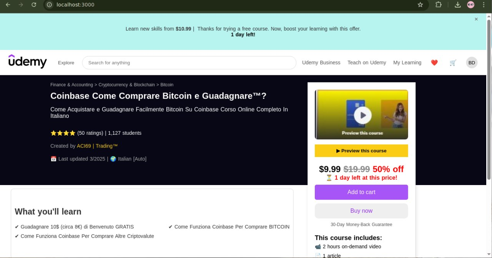

<<<<<<< HEAD

# course-page

> My best Nuxt.js project



Live link : (click it ) https://aladiaudemy.netlify.app/

## Build Setup

```bash
# install dependencies
$ npm install

# serve with hot reload at localhost:3000
$ npm run dev

# build for production and launch server
$ npm run build
$ npm run start

# generate static project
$ npm run generate
```

# For detailed explanation on how things work, check out [Nuxt.js docs](https://nuxtjs.org).

# UdemySinglePageClone

Test For NuxtJS Front-End Developer

> > > > > > > 6579059b575d234fd07a02c78e81d22bc7dafc2c
